<p style="display: flex; flex-flow: column wrap; align-items: center; justify-content: center;">
  <h1 align="center">REBUS</h1>
  
  <span style="margin-top: 20px;"> &#128161 A Simple Game Project. </span>
</p>

<hr/>

# Contents

- [How to contribute](#How-to-Contribute)
  - [Fork this repository](#Fork-this-repository)
  - [Clone this repository](#Clone-this-repository)
    - [Clone this repository to Vscode](#Clone-this-repository-to-Vscode)
    - [Import from Github to Replit](#Import-from-Github-to-Replit)
  - [Make changes](#Make-changes)
  - [See your changes](#See-your-changes)
    - [Check changes on Vscode](#Check-changes-on-Vscode)
    - [Check changes on Replit](#Check-changes-on-Replit)
  - [Commit and Push changes to Github](#Commit-and-Push-changes-to-Github)
    - [Commit and Push from VScode](#Commit-and-Push-from-VScode)
    - [Commit and Push from Replit](#Commit-and-Push-from-Replit)
  - [Submit your changes for review](#Submit-your-changes-for-review)
- [Upcoming Features for Rebus](#Upcoming-Features-for-Rebus)

# How to Contribute

If you don't have git on your machine, [install it](https://help.github.com/articles/set-up-git/).

If you don't have Vscode, [install it](https://code.visualstudio.com/download).

If you don't have a replit account, feel free to create one [here](https://replit.com/signup).

## Fork this repository

Fork this repository by clicking on the fork button on the top of this page. This will create a copy of this repository in your account.


Then create fork


## Clone this repository

In this section, I will give full details on how to clone this repo on Vscode and Replit. You can choose any one between the two to contribute to this project.

### Clone this repository to Vscode

Firstly, you have to create a personal token. click [here](https://docs.github.com/en/enterprise-server@3.4/authentication/keeping-your-account-and-data-secure/creating-a-personal-access-token) to create one and strictly follow the steps and instructions there.

 _Skip to [Import from Github to Replit](#Import-from-Github-to-Replit)]_

Now clone the forked repository to your machine. Go to your Github account and open the forked repository, click on the `code` button then click the _copy to clipboard_ icon as shown below:


If successfully copied, you should get this:


Open your Vscode click on Terminal section and click `new terminal` to open a terminal in vscode or use `ctrl + f7` as shown below:

 

When it is opened, run the following git commands:

```
git clone https://{YOUR_PERSONAL_TOKEN}@github.com/{YOUR_USERNAME}/Rebus-Puzzles_webpage.git
```

:bulb: Replace {YOUR_PERSONAL_TOKEN} with the personal access token generated from the first step above. Replace {YOUR_USERNAME} with your github username as shown below.

:bulb: right-click on the terminal to paste what you just copied.


If successful, you should get this;


### Import from Github to Replit

If you don't have replit account, create one [here](https://replit.com/signup).

If done with the creating and set-ups or already created, navigate to the `home` section and check under `My repls` section, click on the `create` button to create new repl as shown below:


After that, on the section that pops up click on  `import from Github` button which is at the right top corner of the section as shown below:


Go to the tab of your cloned repository and copy the URL as shown below:


Then input the copied URL into the space labelled 1. in the pic below:


If the (2) language detected is `Node.js`, change it to `HTML,CSS & JS` as shown above.

Then if you've done these steps above, click on the button labelled (3) `Import from Github`.

Boom!!! You've just imported the cloned repo from Github to Replit :grin:

Just wait for some seconds for everything to load onto the screen.

## Make changes

### On Vscode

  If terminal is still open, change directory to the new Rebus-Puzzles_webpage, using  this command:

  ```
  cd Rebus-Puzzles_webpage
  ```

  

  Then use this command to open the repository folder on Vscode.

  ```
  code .
  ```

  

  This will open a new window of Vscode with the Rebus cloned repo folder.

### On Replit

Just go ahead to the `Next step` below.

#### Next step

Now click on the src folder and open `Rebuses.jsx` file.

 

Add your own rebus to it. **Don't add it at the beginning or end of the file. Put it anywhere in between.** Using this format;

```
{
    pattern: ``,
    answer: ``,
    hint: ``,
},
```


:bulb: Those commas ',' in the format above are very important.

Note: In your rebus `pattern`, if you want to include emojis. You can get the full list of html emojis at [HTML Emojis](https://www.w3schools.com/charsets/ref_emoji.asp) then use them these ways;

- If you are using the `dec code` of your preferred emoji, write the `dec code` in this format into the pattern (`&#the-dec-code`)

- If you feel like using the `hex code`, write it in this format (`&#xthe-hex-code`)

Examples are provided in the `Rebuses.jsx` file.

## See your changes

### Check changes on Vscode

  _skip to [Check changes on Replit](#Check-changes-on-Replit)_

If terminal is not open, Open the terminal then change directory to the cloned repo and run this command:

```
npm install
```


Wait for the installation to finish. You should get this:


After the installation is successful, run this command:

```
npm run dev
```


then press `alt` on your keyboard and click on the `http://localhost:.../`


This will automatically open your browser and render the result on your screen in the browser tab.


### Check changes on Replit

Click on the `shell` button at the right side section to run this command:

```
npm install
```


If you get the above error and suggestion;

Just press `Enter` on your keyboard to continue.


Wait for the installation to complete.


After the installation is successful as shown above, run this command:

```
npm run dev
```


Then click on the `Webview` button and after some seconds, you will see the webpage render to the screen there as shown below:


:bulb: You can click on the button labelled (2) to view in fullscreen.

Note: If you don't get the result after some minutes, go to the shell and click on the `http://localhost:.../`

## Commit and Push changes to Github

### Commit and Push from VScode

 _skip to [Commit and Push from Replit](#Commit-and-Push-from-Replit)_

- Open a new terminal (ctrl + f7), change directory to the project directory and execute the commands if you haven't done it before:

```
git config --global user.email "youremail@example.com"
```

example:

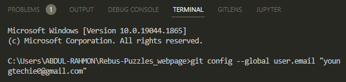

After that, execute this command also:

```
git config --global user.name "Your name"
```

example:

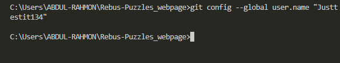

Successfully done? move to the next section below.

- Execute this command to see the file(s) you made changes in:

```
git status
```

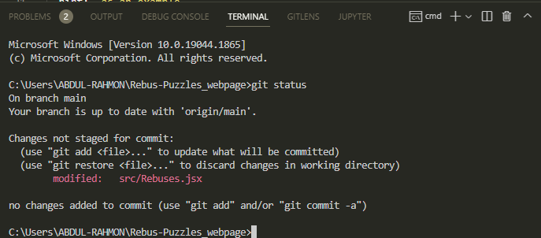

- Add those changes to your branch using the `git add .` command:

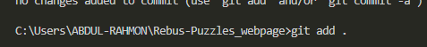

- Now commit those changes using this command:

```
git commit -m "<your-name> added <number-of-rebus-you-added> rebus(es)"
```

replacing `<your-name>` with your name and `<number-of-rebus-you-added>` with the number of rebus(es) you just added as shown below.

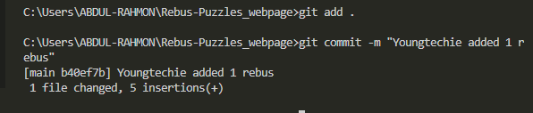

- Push your changes using the command:

```
git push
```

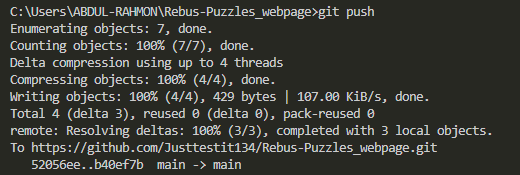

Boom!!!!! You have successfully pushed the changes to your cloned repo from Vscode. :grin:

### Commit and Push from Replit

To commit and push from Replit, follow the images below:

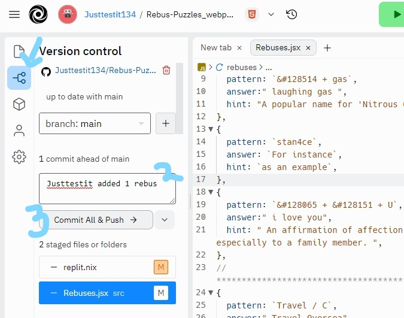

Click on the button the arrow is pointing at, and fill in your commit into the field labelled (2), then click on the button `commit all & push` as labelled (3) in the image above.

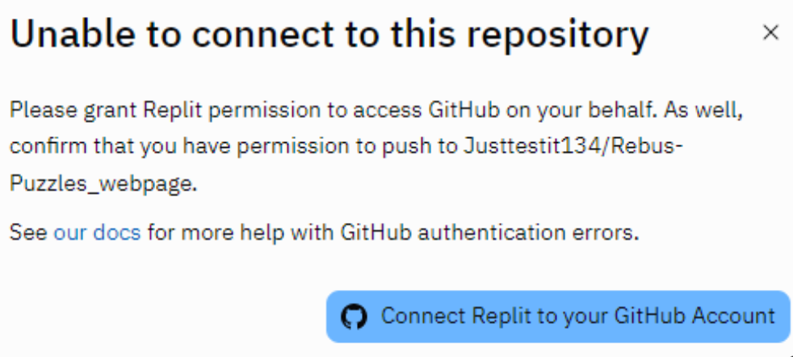

If the above pops up, click on the `connect replit to your github account`.

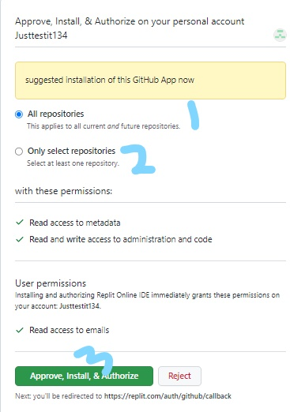

In the above image, you can choose to pick one out of the label (1) and (2).

then click on the label (3) to continue.

Next, you should see this:

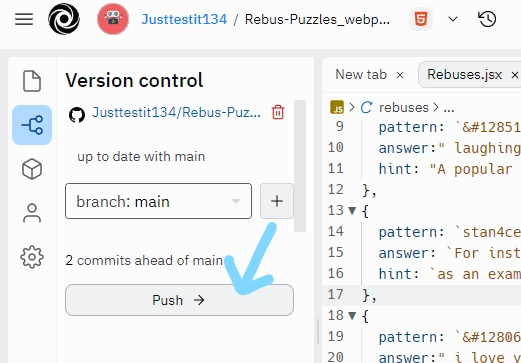

Click on the button labelled `push`

Then, you are done with the pushing if you get this: 

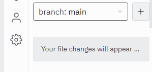

Booyah!!! :grin:

## Submit your changes for review

Now go back to the cloned repository on your Github account, you'll see a `Contribute` and `Sync fork` buttons as shown below:

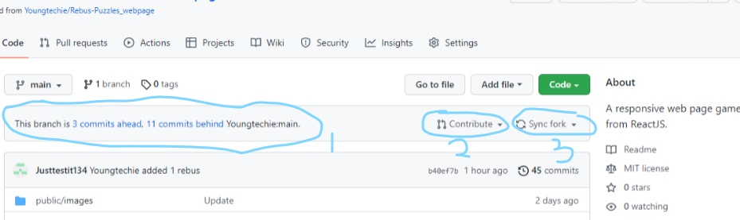

**This is important** - click on the `sync fork` as labelled (3) in the image above first to update your forked repository from the latest commit of the original Rebus-Puzzles_webpage repository because sometimes, you might not notice the labelled (1) but doing this will save you some stress which you will face if not done.

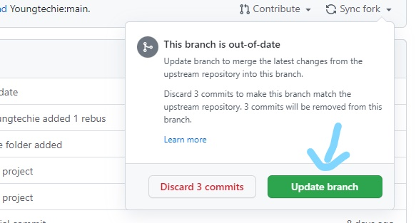

- After you have gotten the message:

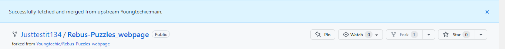

Then click on the `contribute` button to send a pull request.

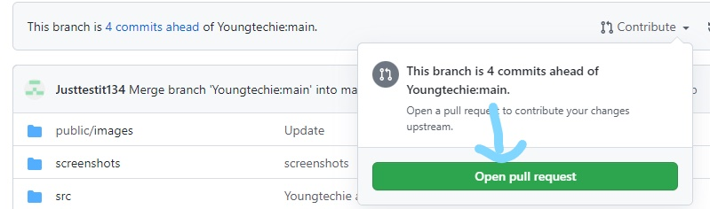

:bulb: A pull request is an event that takes place in software development when a contributor/developer is ready to begin the process of merging new code changes with the main project repository.

Now sumbit the pull request.

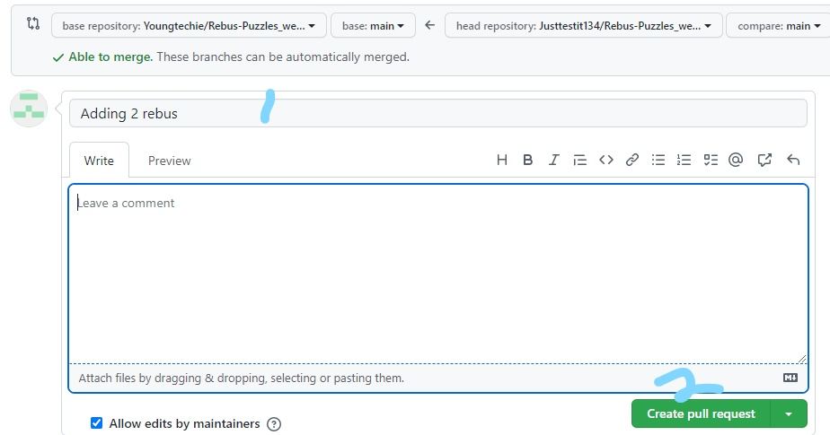

Scroll down to see your changes.

for example:

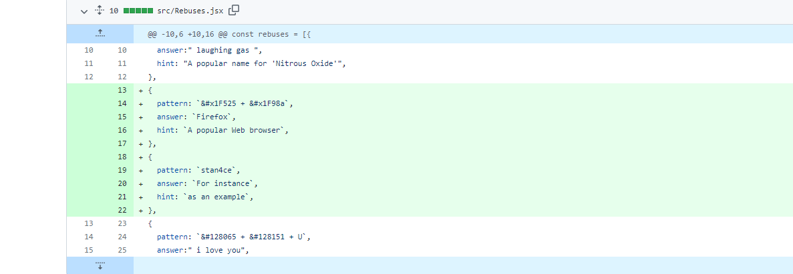

You can also the preview of your changes by click :

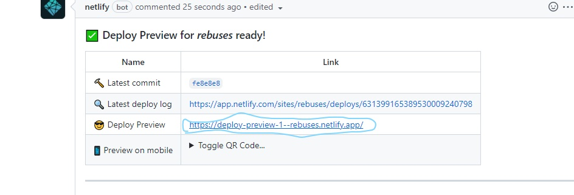

Soon I'll be merging all your changes into the main branch of this project. You will get a notification email once the changes have been merged.

Thank you for your contribution Champ :trophy: :relaxed:

# Upcoming Features for Rebus

- New UI for desktop view.
- Warning when hint or get answer button is click with insufficient point.
- Input your name before starting the game.

:bulb: You can also send in the feature(s) you think I should add by emailing youngtechie0@gmail.com. Thank you :kissing_heart: