<p style="display: flex; flex-flow: column wrap; align-items: center; justify-content: center;">
  <h1 align="center">REBUS</h1>
  
  <span style="margin-top: 20px;"> &#128161 A Simple Game Project. </span>
</p>

<hr/>

# Contents

- [How to contribute](#How-to-Contribute)
  - [Fork this repository](#Fork-this-repository)
  - [Clone this repository](#Clone-this-repository)
    - [Clone this repository to Vscode](#Clone-this-repository-to-Vscode)
    - [Import from Github to Replit](#Import-from-Github-to-Replit)
  - [Make changes](#Make-changes)
  - [See your changes](#See-your-changes)
    - [Check changes on Vscode](#Check-changes-on-Vscode)
    - [Check changes on Replit](#Check-changes-on-Replit)
  - [Commit and Push changes to Github](#Commit-and-Push-changes-to-Github)
    - [Commit and Push from VScode](#Commit-and-Push-from-VScode)
    - [Commit and Push from Replit](#Commit-and-Push-from-Replit)
  - [Submit your changes for review](#Submit-your-changes-for-review)
- [Upcoming Features for Rebus](#Upcoming-Features-for-Rebus)

# How to Contribute

If you don't have git on your machine, [install it](https://help.github.com/articles/set-up-git/).

If you don't have Vscode, [install it](https://code.visualstudio.com/download).

If you don't have a replit account, feel free to create one [here](https://replit.com/signup).

## Fork this repository

Fork this repository by clicking on the fork button on the top of this page. This will create a copy of this repository in your account.

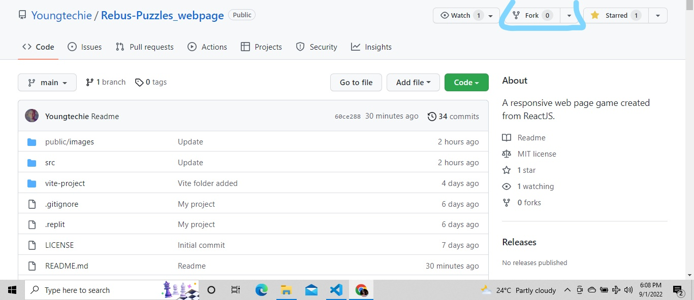

Then create fork

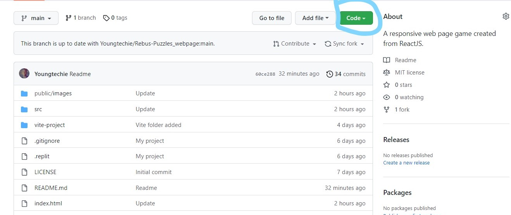

## Clone this repository

In this section, I will give full details on how to clone this repo on Vscode and Replit. You can choose any one between the two to contribute to this project.

### Clone this repository to Vscode

  _Skip to [Import from Github to Replit](#Import-from-Github-to-Replit)]_

Now clone the forked repository to your machine. Go to your Github account, open the forked repository, click on the `code` button then click the _copy to clipboard_ icon as shown below:

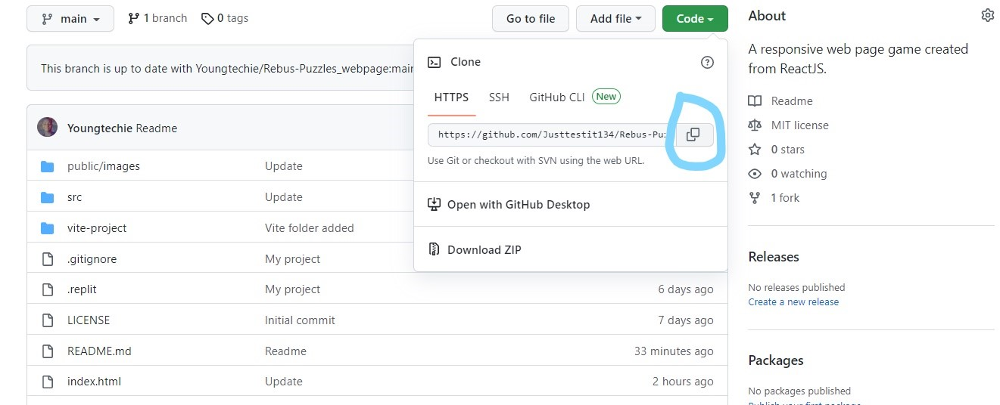
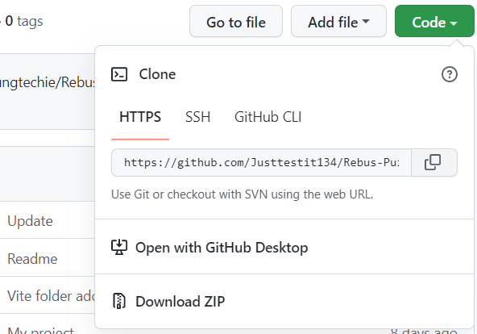

If successfully copied, you should get this:

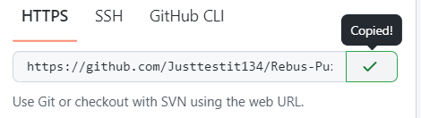

Open your Vscode click on Terminal section and click `new terminal` to open a terminal in vscode or use `ctrl + f7` as shown below:

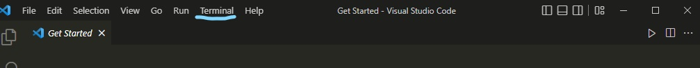 

When it is opened run the following git commands:

```
git clone "url you just copied"
```

:bulb: where "url you just copied" is the url to this repository (without the quotation marks) as shown below.

:bulb: right-click on the terminal to paste what you just copied.

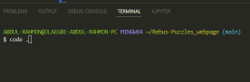

```
git clone https://github.com/this-is-you/Rebus-Puzzles_webpage.git
```

Where `this-is-you` is your Github username.

If successful, you should get this;

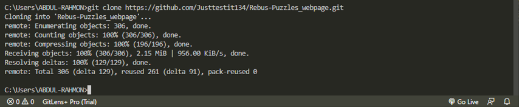

### Import from Github to Replit

If you don't have replit account, create one [here](https://replit.com/signup).

If done with the creating and set-ups or already created, navigate to the `home` section and check under `My repls` section, click on the `create` button to create new repl as shown below:

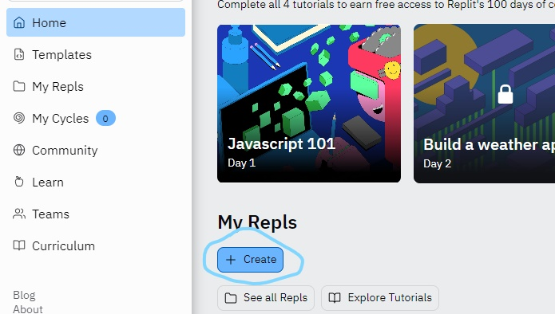

After that, on the section that pops up click on  `import from Github` button which is at the right top corner of the section as shown below:

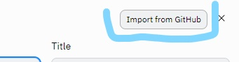

Go to the tab of your cloned repository and copy the URL as shown below:

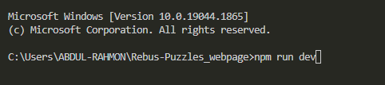

Then input the copied URL into the space labelled 1. in the pic below:

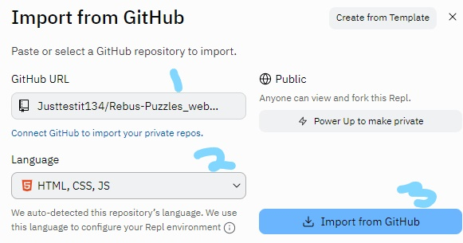

If the (2) language detected is `Node.js`, change it to `HTML,CSS & JS` as shown above.

Then if you've done those steps above, click on the button labelled (3) `Import from Github`.

Boom!!! You've just imported the cloned repo from Github to Replit :grin:

## Make changes

### On Vscode

  If terminal is still open, change directory to the new Rebus-Puzzles_webpage, using  this command:

  ```
  cd Rebus-Puzzles_webpage
  ```

  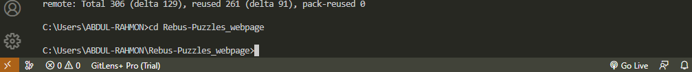

  Then use this command to open the repository folder on Vscode.

  ```
  code .
  ```

  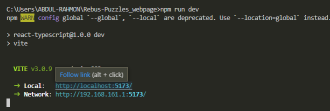

  This will open a new window of Vscode with the Rebus repo folder you cloned.

### On Replit

Just go ahead to the `Next step` below.

#### Next step

Now click on the src folder and open `Rebuses.jsx` file.

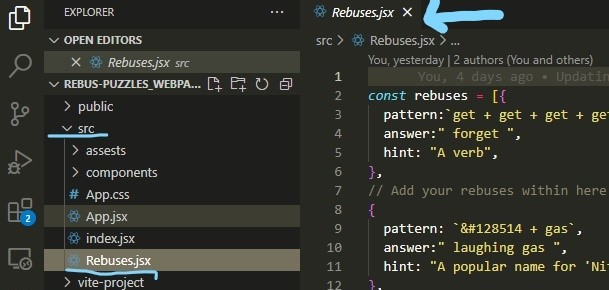 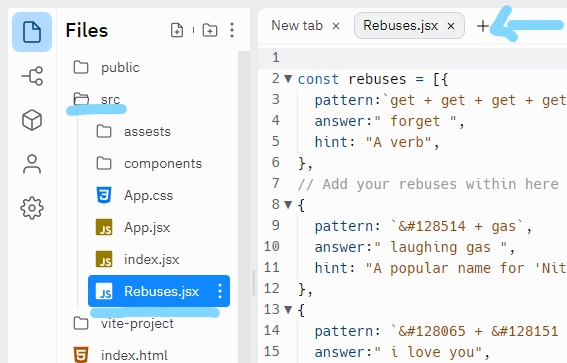

Add your own rebus to it. **Don't add it at the beginning or end of the file. Put it anywhere in between.** Using this format;

```
{
    pattern: ``,
    answer: ``,
    hint: ``,
},
```

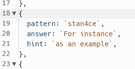
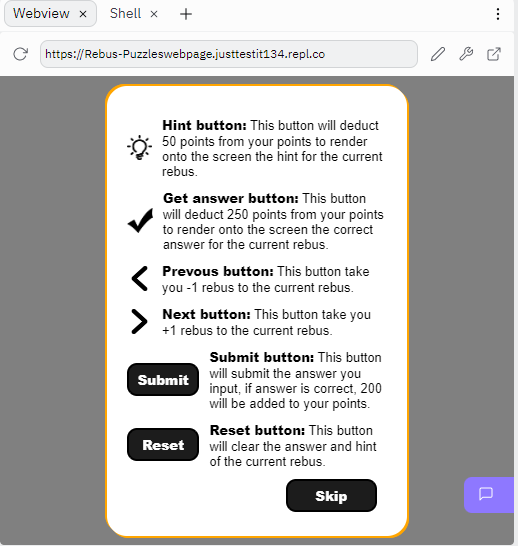

:bulb: Those commas ',' in the format above are very important.

Note: In your rebus `pattern`, if you want to include emojis. You can get the full list of html emojis at [HTML Emojis](https://www.w3schools.com/charsets/ref_emoji.asp) then use them these ways;

- If you are using the `dec code` of your preferred emoji, write the `dec code` in this format into the pattern (`&#the-dec-code`)

- If you feel like using the `hex code`, write it in this format (`&#xthe-hex-code`)

Examples are provided in the `Rebuses.jsx` file.

## See your changes

### Check changes on Vscode

  _skip to [Check changes on Replit](#Check-changes-on-Replit)_

If terminal is not open, Open the terminal then change directory to the cloned repo and run this command:

```
npm install
```

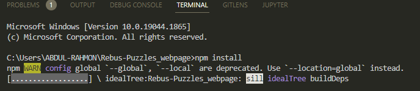

Wait for the installation to finish. You should get this:

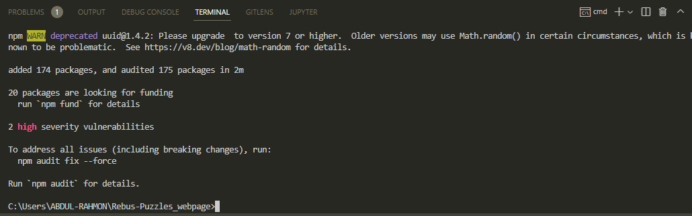

After the installation is successful, run this command:

```
npm run dev
```

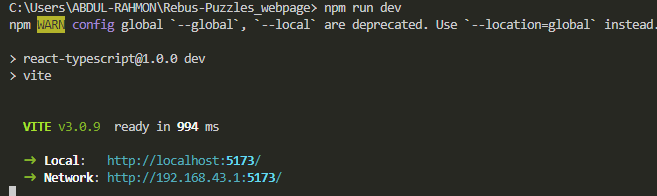

then press `alt` on your keyboard and click on the `http://localhost:.../`

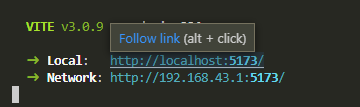 

This will automatically open your browser and render the result on your screen in the browser tab.

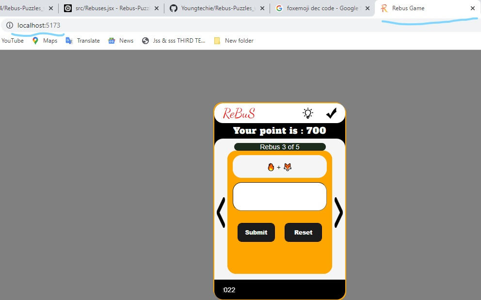

### Check changes on Replit

Click on the `shell` section to run this command:

```
npm install
```

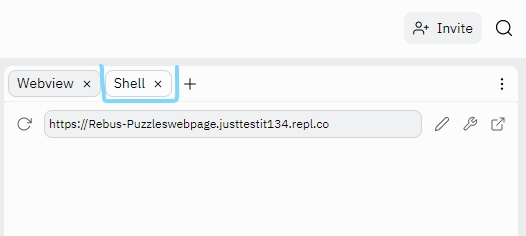

If you get this:

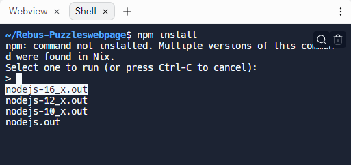

Just press `Enter` on your keyboard to continue.


Wait for the installation to complete.

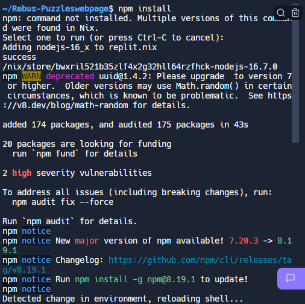

After the installation is successful as shown above, run this command:

```
npm run dev
```

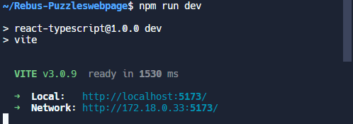

Then back to the `Webview` section and after some seconds, you will see the webpage render to the screen there as shown below:

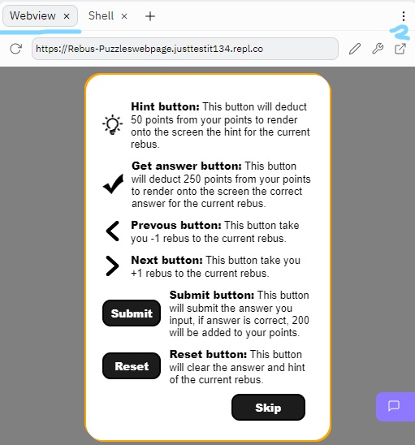

:bulb: You can click on the button labelled (2) to view in fullscreen.

## Commit and Push changes to Github

### Commit and Push from VScode

 _skip to [Commit and Push from Replit](#Commit-and-Push-from-Replit)_

- Open a terminal, change directory to the project directory and execute the command `git status`, you'll see the changes and what file you made the changes.

- Add those changes to your branch using the `git add .` command:

- Now commit those changes using this command:

```
git commit -m "<your-name> added <number-of-rebus-you-added> rebus(es)"
```

replacing `<your-name>` with your name and `<number-of-rebus-you-added>` with the number of rebus(es) you just added.

- Check the name of the branch you have been working on using the command `git branch`. If branch is more than one, the current one you are working on will have an asterisk (*) in front of it as shown below. 

- Push your changes using the command:

```
git push origin <branch-name>
```

replace `<branch-name>` with `main`,`master` or your current branch name.


<details>
<summary> <strong>If you get any errors while pushing, click here:</strong> </summary>

- ### Authentication Error

     <pre>remote: Support for password authentication was removed on August 13, 2021. Please use a personal access token instead.
  remote: Please see https://github.blog/2020-12-15-token-authentication-requirements-for-git-operations/ for more information.
  fatal: Authentication failed for 'https://github.com/<your-username>/Rebus-Puzzles_webpage.git/'</pre>  
   Go to [GitHub's tutorial](https://docs.github.com/en/authentication/connecting-to-github-with-ssh/adding-a-new-ssh-key-to-your-github-account) on generating and configuring an SSH key to your account.

</details>

### Commit and Push from Replit

To commit and push from Replit, follow the steps and images below:

## Submit your changes for review

Now go back to the cloned repository on your Github account, you'll see a `Contribute` and `Sync fork` buttons as shown below:

**This is important** - click on the `sync fork` button first to update your forked repository from the latest commit of the original Rebus-Puzzles_webpage repository.


- After you have gotten the message ``, then click on the `contribute` button to send a pull request.


:bulb: A pull request is an event that takes place in software development when a contributor/developer is ready to begin the process of merging new code changes with the main project repository.

Now sumbit the pull request.


Soon I'll be merging all your changes into the main branch of this project. You will get a notification email once the changes have been merged.

Thank you for your contribution Champ

# Upcoming Features for Rebus

- New UI for desktop view.
- Warning when hint or get answer button is click with insufficient point.
- Input your name before starting the game.

:bulb: You can also send in the feature(s) you think I should add by emailing youngtechie0@gmail.com. Thank you :kissing_heart: