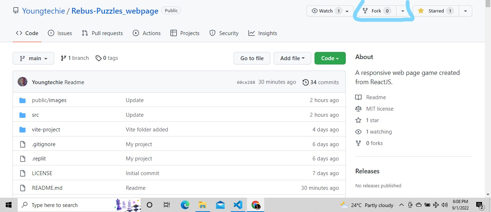
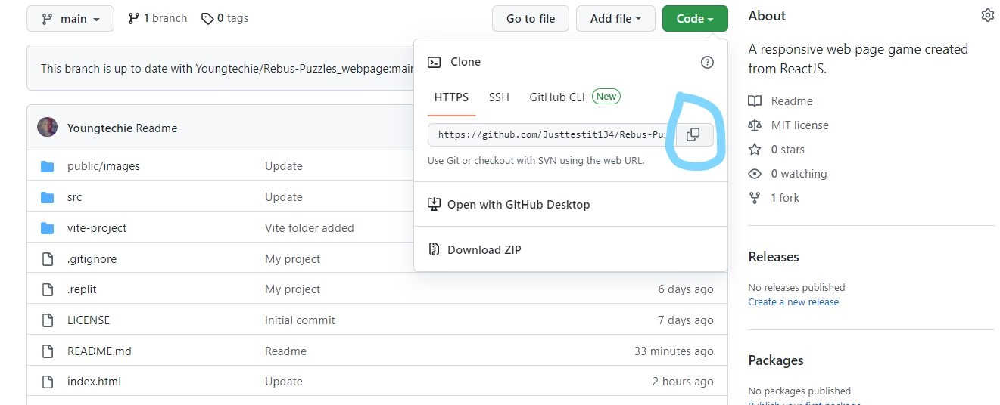
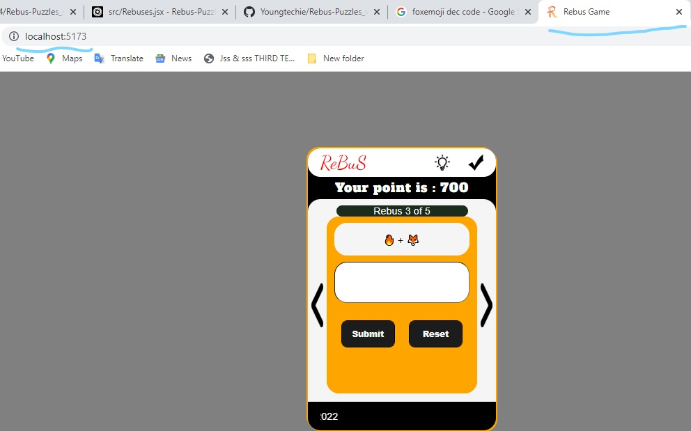
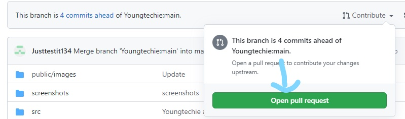

<p align="center">
  
  <h1 align="center">ReBuS</h1>
  <p align="center">💡 A cryptic puzzle game. Open source and open to contributions.</p>
</p>

<hr/>

## Contents

- [How to Contribute](#how-to-contribute)
  - [1. Fork and clone the repo](#1-fork-and-clone-the-repo)
  - [2. Make your changes](#2-make-your-changes)
  - [3. View your changes locally](#3-view-your-changes-locally)
  - [4. Commit, push, and open a pull request](#4-commit-push-and-open-a-pull-request)
- [Upcoming features](#upcoming-features)
- [Contributors](#contributors)

---

## How to Contribute

You'll need **Git** and **Node.js** installed.  
No Git? → [Install Git](https://help.github.com/articles/set-up-git/)  
No Node? → [Install Node.js](https://nodejs.org/)

---

### 1. Fork and clone the repo

**Fork** the repo by clicking the Fork button at the top right of this page — this creates your own copy on GitHub.



Once your fork is ready, click the green **Code** button on your fork and copy the URL.



Open a terminal and run:

```bash
git clone https://github.com/YOUR_USERNAME/Rebus-Puzzles_webpage.git
cd Rebus-Puzzles_webpage
```

> Replace `YOUR_USERNAME` with your actual GitHub username.

---

### 2. Make your changes

Open the project in your editor and navigate to `src/Rebuses.js`.  
Add your own rebus **anywhere in the middle** of the array — not at the very top or bottom — using this format:

```js
{
  pattern: ``,
  answer: ``,
  hint: ``,
},
```

**Tips for writing a pattern:**

- You can use HTML tags to style the pattern (e.g. `<span>`, `<sup>`, `<sub>`, `<h2>`).
- No `` tags — emoji only.
- For emoji, grab a code from [HTML Emoji Reference](https://www.w3schools.com/charsets/ref_emoji.asp) and use it like this:
  - Decimal: `&#128514;`
  - Hex: `&#x1F602;`

---

### 3. View your changes locally

Install dependencies (only needed the first time):

```bash
npm install
```

Start the dev server:

```bash
npm run dev
```

Then open the local URL printed in your terminal (usually `http://localhost:5173`) to see the game running with your new rebus in it.



---

### 4. Commit, push, and open a pull request

**Stage and commit your changes:**

```bash
git add .
git commit -m "Your Name — added <total number of rebuses added by you> rebus(es)"
```

**Push to your fork:**

```bash
git push
```

Now go to your fork on GitHub. You'll see a **Contribute** button — click it, then **Open pull request**.



Give your PR a clear title, then click **Create pull request**. That's it — I'll review and merge it soon, and you'll get an email when it's done. Thanks, Champ 🏆

---

## Upcoming features

- Desktop UI redesign
- Warning when hint/reveal is clicked with insufficient points
- Enter your name before starting the game

Have an idea? Send it to olaegbeolamilekan1@gmail.com.

---

## Contributors

<a href="https://github.com/Youngtechie/Rebus-Puzzles_webpage/graphs/contributors">
  
</a>